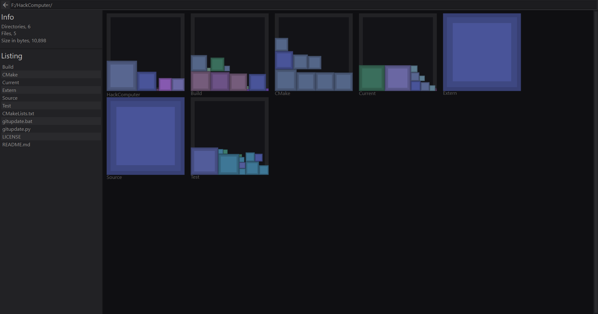
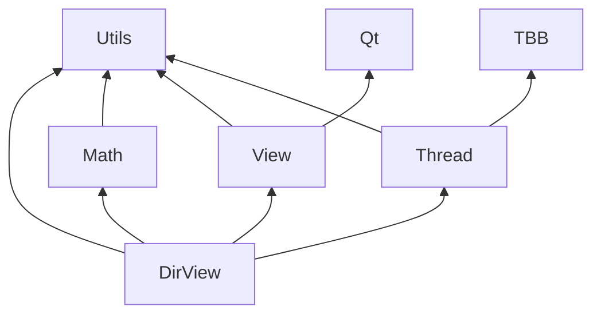

# DirView

Sample directory viewer.



## Testing

The testing directory is setup to work with [googletest](https://github.com/google/googletest).

## Building


```sh
mkdir Build
cmake -S . -B Build -DDirView_BUILD_TEST=ON -DDirView_AUTO_RUN_TEST=ON
cmake --build Build
```

Optional defines.

| Option                      | Description                                          | Default |
|:----------------------------|:-----------------------------------------------------|:-------:|
| DirView_BUILD_TEST         | Build the unit test program.                         |   ON    |
| DirView_AUTO_RUN_TEST      | Automatically run the test program.                  |   OFF   |


# Dependencies


